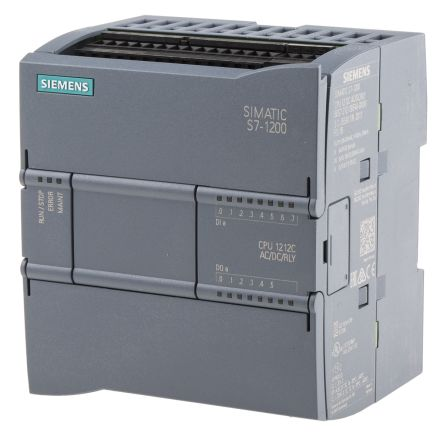

# Siemens PLC s7 | PYTHON
Simple write and read  on plc s7

## What you need



You should download following link:
wget http://sourceforge.net/projects/snap7/files/1.2.1/snap7-full-1.2.1.tar.gz/download
or I put this version on **OS/** folder

- [ ] On Debian-base OS:
```bash
tar -zxvf snap7-full-1.2.1.tar.gz
cd snap7-full-1.2.1/build/unix && sudo make -f arm_v6_linux.mk all
sudo cp ../bin/arm_v6-linux/libsnap7.so /usr/lib/libsnap7.so
sudo cp ../bin/arm_v6-linux/libsnap7.so /usr/local/lib/libsnap7.so
sudo apt-get install python3-pip
sudo pip3 install python-snap7
sudo ldconfig
```

- [ ] On Windows Only copy files on **OS/** folder to System32 folder
Here is the code:

```python

import snap7

plc = snap7.client.Client()
plc.connect('192.168.2.100', 0, 1)

```

<span style="color:red">Happy Codding 🍓</span>

> Peyman Majidi 
